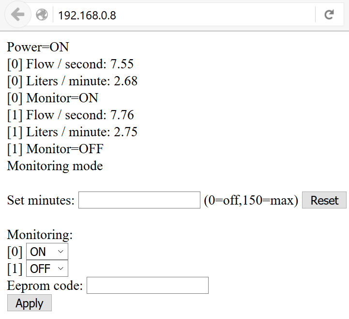

failsafe
========

## Synopsis

Failsafe is a project to determine if water is still flowing in a closed water loop for computer cooling. If the water is not flowing it will cut the power to the pump and computers. The computers are cooled with an external radiator and pump which is outside the house. Since these systems are far apart an Arduino monitors the flow to ensure that pumps will not run dry or there is no electric short when there is a water leak or an unknown incident.

Inside the house each computer is split into its own water loop via a manifold. Using flowmeters for each loop an http server display the flow-per-second so that the manifold valves could be adjusted manually. The data is also made available as JSON via rest for an external monitoring software solution running on a seperate Raspberry Pi.

## Code

As the project progressed more features got added:
- Arduino_email: Monitors a single water loop and send an email when the circuit breakers is activated.
- Arduino_dual: Monitors multiple water loops, expose data in rest for external monitoring and removed email.
- Arduino_nvram: Monitors multiple water loops and make it possible to service a computer. It stores the last config in nvram, so when it restarts it will remember what loops needs to be monitored.

## Motivation

The computers are on 24/7 and with water cooling things sometimes go wrong. But it was also an opportunity to learn more about hardware programming and the Arduino.

## Installation

Hardware:

- 1x Arduino
- 1x Arduino Ethernetboard (Duemilanova w/Atmega328)
- 3x water flow meters
- 1x 220v switch

## Circuits

- fritzing = logical circuit drawing
- picture = circuit board (With before pictures)

## Tests

There was several leaks over the years and the failsafe works.

## Example

Below is a sample screen of what you can control via the web server.

- In this example only two loops are active and only loop-0 is being monitored.
- Set minutes. Allows you to temporary disable monitoring. This is needed when you service the outside loop (radiator) or when you start the system. It will countdown and eventually reset to monitoring mode.
- Change ON/OFF per loop. This allows you to enable/disable monitoring per loop. Useful if you service a computer. The eeprom-code option allow you to save this setting into eeprom.

## Contributors

https://github.com/simketejong

https://tweakers.net/gallery/224980